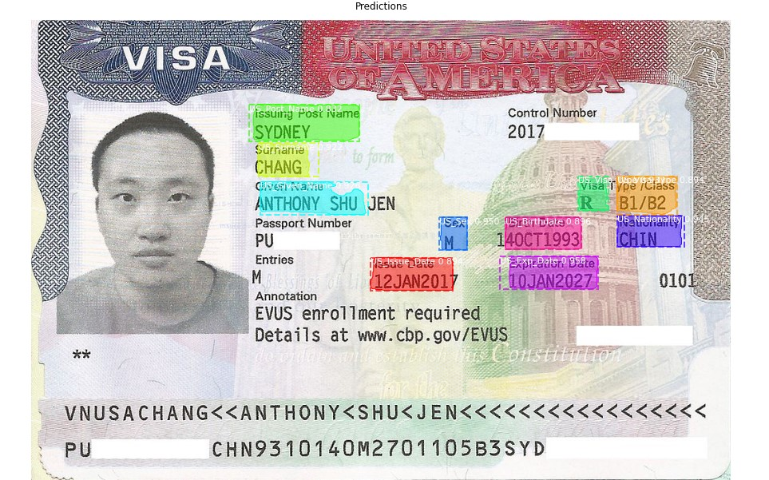
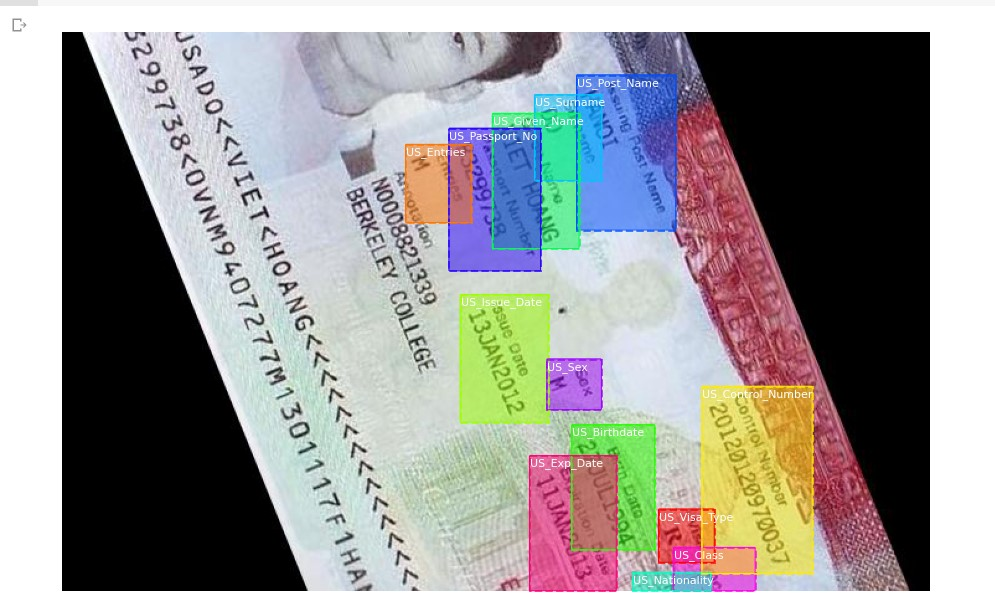

# ID-Cards-Classidifcation
 ID-Cards Classifications Using Mask RCNN

 This Is Implementation of Mask_RCNN to Classify ID card and segment their fields.

 Its Uses Transfer learning with RESNET 101 as backbone.

 You will need a GPU for training. CPU based training is extremely slow.

